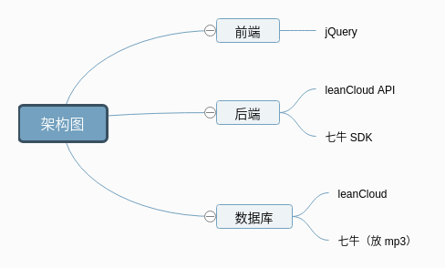
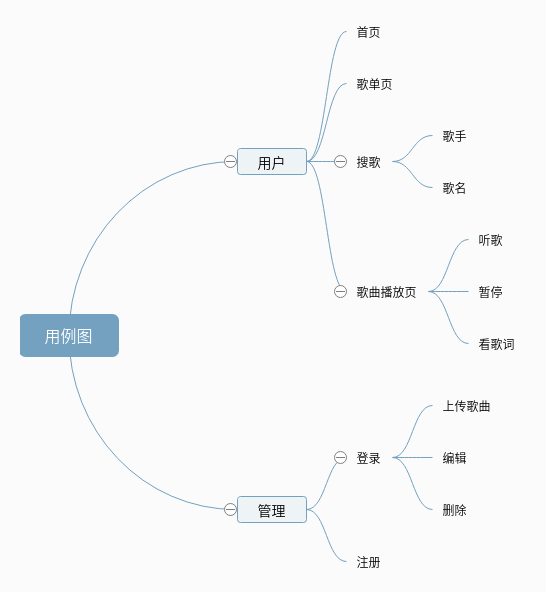
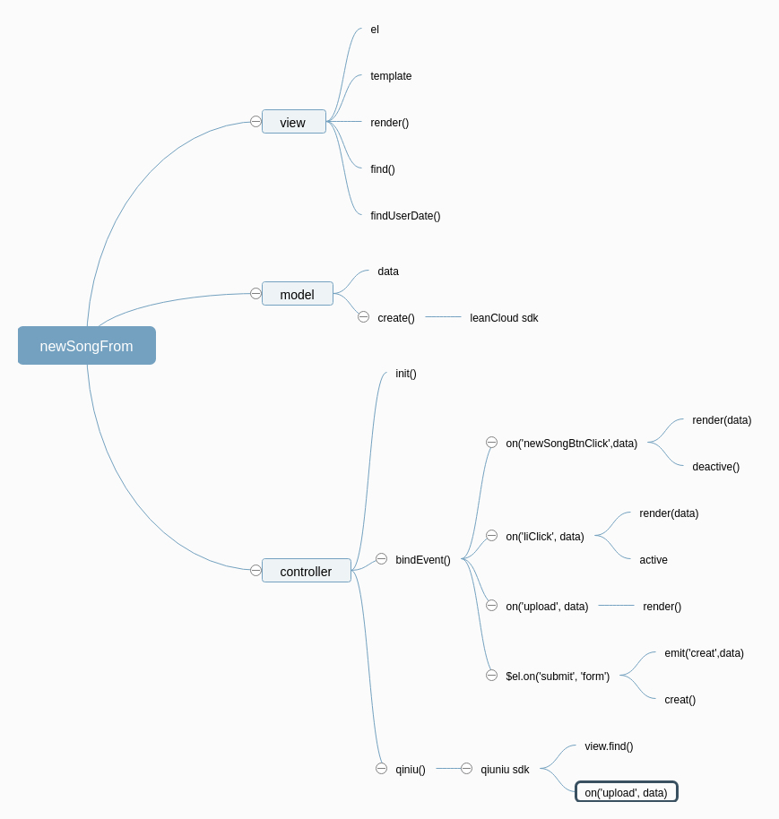
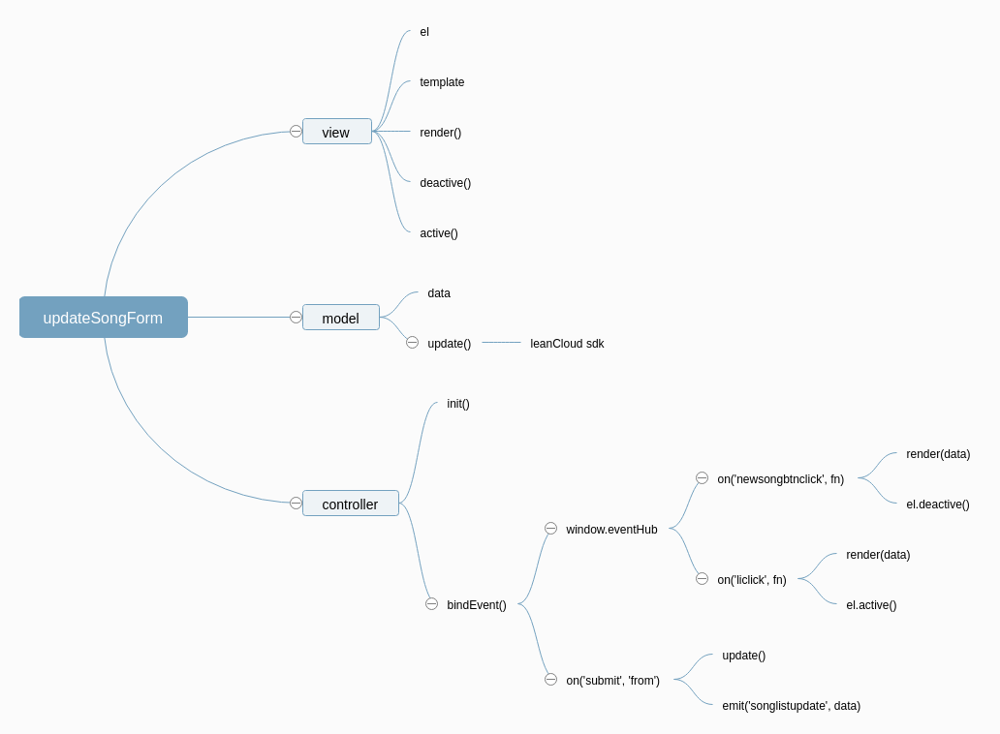
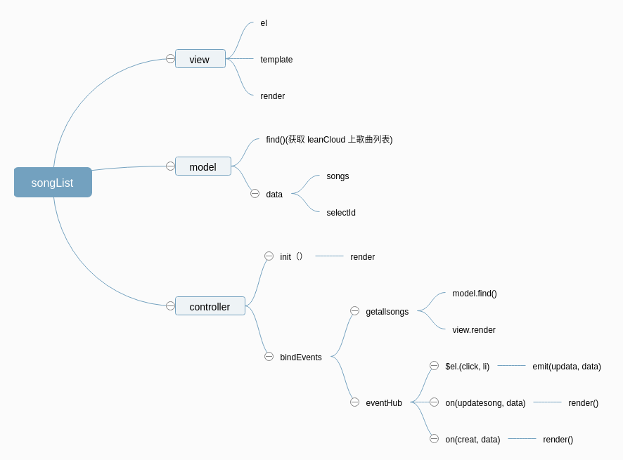

# [网易云音乐项目踩坑与套路](https://unbrain.github.io/2018/06/01/%E7%BD%91%E6%98%93%E4%BA%91%E9%9F%B3%E4%B9%90%E9%A1%B9%E7%9B%AE%E8%B8%A9%E5%9D%91%E4%B8%8E%E5%A5%97%E8%B7%AF/)

## 架构图

## 用例图

## 草图

## 主要思路

